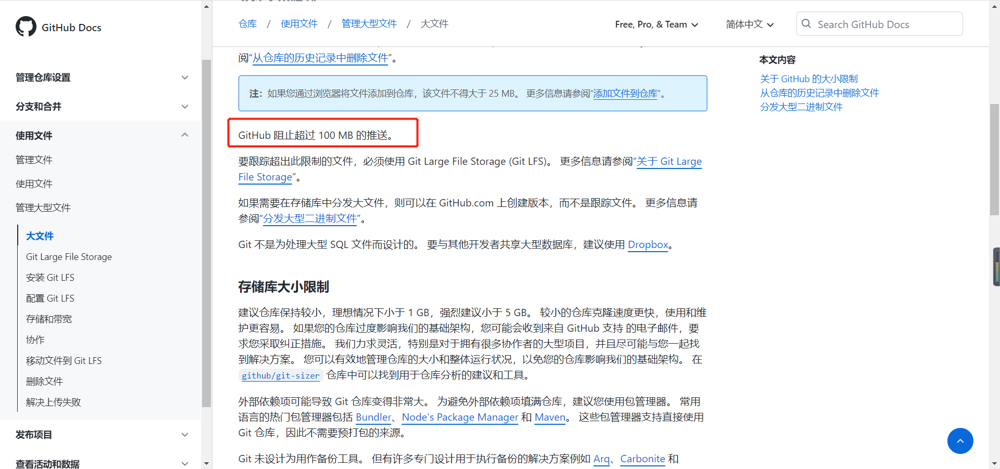

# 1、git push出现的问题
今天想push文件，然而push的时候出现了问题，如图所示

发现这个问题后，发现了前几天有传一个**超过了100M的**zip文件到仓库了，但是已经删除了，但是不知道为什么没有加载到

TIPS:

不能超过100M是github的限制具体见github的文档
[关于 GitHub 上的大文件](https://docs.github.com/cn/repositories/working-with-files/managing-large-files/about-large-files-on-github)

思考：想要把git add 放到暂存区的文件进行删除 或者说是撤销，参考了文章
[Git 如何撤销已被放入暂存区的文](https://blog.csdn.net/yingleiming/article/details/109232853)，|
git reset HEAD -- . (注意最后的一个".",这条命令帮助我们一次性撤销所有放入暂存区的文件)
并没有什么用，没办法了，谁叫前几天传完代码不上传呢。。

解决方法：只能重新拉取一遍代码，后把今天所写的项目的代码 copy一份 然后 重新push到远程仓库