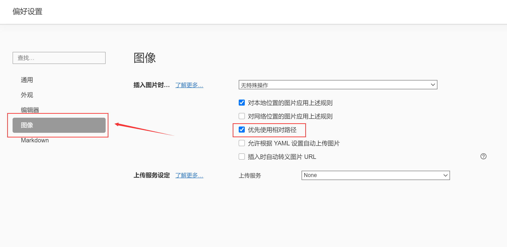

# 1、图片的载入
一直以为markdown的图片只能用网络地址进行加载，现在遇到的问题是，怎么快速加载该项目所对应的图片呢，那么我们可以使用相对的路径，现在的话，有一个配置

>  下面设置在 typora 编辑器中，图片使用相对路径的方法

### 点击文件 -> 偏好设置 -> 图像，如下图所示!

 直接勾选 优先使用相对路径，选项即可。

上面的想法就是想把图片资源上传到服务器，那么如上图所示，typora也给我们提供了上传服务的设定，比如使用[PicGo-Core](https://picgo.github.io/PicGo-Core-Doc/)，有兴趣可以点击网址进行使用

pigo-core是什么？
PicGo-Core是[PicGo](https://github.com/Molunerfinn/PicGo)2.0版本里将会预置的底层核心组件。它可以看做是一个简单的上传流程系统。

