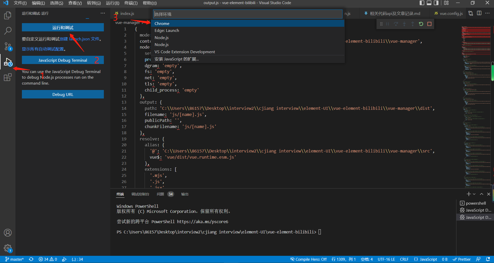

# Vue-cli项目在 VS Code 中调试

## 参考网站

[在 VS Code 中调试](https://cn.vuejs.org/v2/cookbook/debugging-in-vscode.html)

[vue项目如何debug/三种方式/ chrome + vscode + vue devtool](https://www.bilibili.com/video/BV1eh411B7rT?spm_id_from=333.1007.top_right_bar_window_history.content.click)

## 背景

这个案例展示了如何在 VS Code 中调试浏览器中运行的通过 Vue CLI 生成的 Vue.js 应用程序。

官方推荐使用扩展 Debugger for Chrome，vscode当前版本已经自带了这个功能了，


## 如何在浏览器中展示源代码
*理解一个概念：source-map=*

*做了这件事之后，我们的调试器就有机会将一个被压缩的文件中的代码对应回其源文件相应的位置。这会确保你可以在一个应用中调试，即便你的资源已经被 webpack 优化过了也没关系。*

```cmd
<!-- 在cmd下输入以下核心的命令，会在当前的目录下输出一个output.js文件，可以查看webpack的配置文件 -->
vue inspect > output.js
我使用的是vue2的项目，可以看到底部有个字段devtool:'source-map'
```

## 如何在项目目录中添加
*使用的是Vue CLI 2，请设置并更新 `config/index.js` 内的 `devtool` property：*
```
devtool: 'source-map',
```
*如果你使用的是 Vue CLI 3，请设置并更新 `vue.config.js` 内的 `devtool` property：*
```
module.exports = {
  configureWebpack: {
    devtool: 'source-map'
  }
}
```

## 从vscode启动应用
核心文件，在 .vscode 文件夹下创建 `launch.json`,可以通过左侧菜单栏的运行与调试按钮，然后回自动生成文件 `launch.json`


`具体代码如下:`
```js
// launch.json
{
    // 使用 IntelliSense 了解相关属性。 
    // 悬停以查看现有属性的描述。
    // 欲了解更多信息，请访问: https://go.microsoft.com/fwlink/?linkid=830387
    "version": "0.2.0",
    "configurations": [
        {
            "type": "pwa-chrome",
            "request": "launch",
            "name": "vuejs: chrome",
            "url": "http://localhost:8080",
            "webRoot": "${workspaceFolder}/src",
            "breakOnLoad": true,
            "sourceMapPathOverrides": {
              "webpack:///src/*": "${webRoot}/*"
            }
          },
    ]
}
// 如果是 firefox的话，请参考下官方网站的配置,这里只列出了chrome的配置项，关键字段  "type": "pwa-chrome", 官网 "type": "chrome"写错了
```

## 设置一个断点
1. 在 src/components/HelloWorld.vue 的 line90 的地方设置一个断点，这里的 data 函数返回一个字符串。

   

2. 在根目录打开你惯用的终端并使用 Vue CLI 开启这个应用：

   ```
   npm run serve
   ```

3. 来到 Debug 视图，选择**“vuejs：chrome/firefox”**配置，然后按 F5 或点击那个绿色的 play 按钮。

4. 随着一个新的浏览器实例打开 `http://localhost:8080`，你的断点现在应该被命中了。
   

### tips: 

如果想在vscode调试，chrome可能是vscode内置的也可能是vscode默认打开你系统下面的chrome，这个chrome是独一无二的，只作用于该编译器下，所以在打断点后，如果是在浏览器里执行后，那么如果断点结束了，想F5刷新页面再debug在vscode下打的断点，是不生效的，那么需要我们关闭这个浏览器，重新按左上角的`运行与调试按钮`，会重新加载chrome和当前项目，断点又会执行，并可以在vscode下看到。

*弄了这么多，其实* 我的项目是没有生效的，看了视频才知道，是因为vue-cli4 存在的bug的原因。